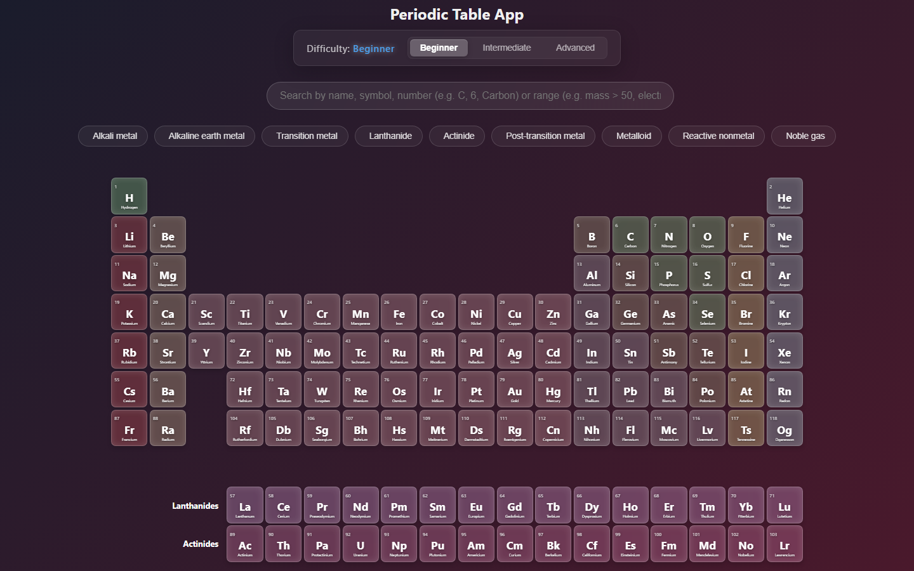
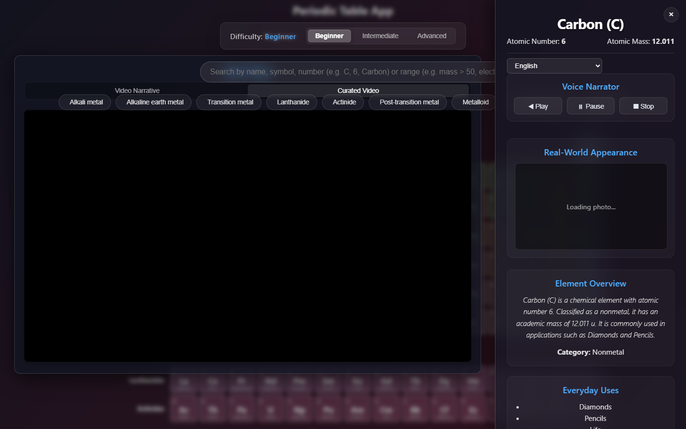
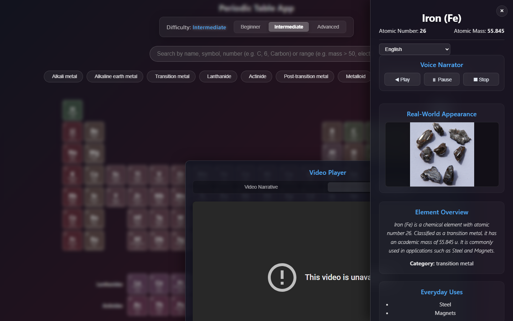
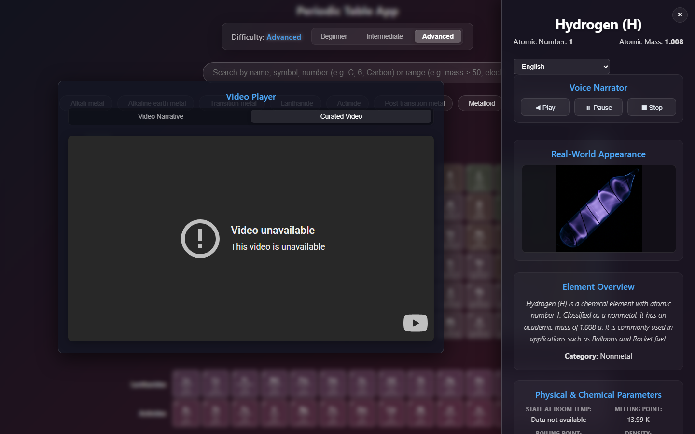

# Interactive Academic Periodic Table App 🧪

[](https://github.com/SavianAlexander/periodic-table-app/actions/workflows/ci.yml)
[](https://github.com/SavianAlexander/periodic-table-app/blob/main/LICENSE)
[](https://react.dev/)
[](https://sqlite.org/)
[](https://vite.dev/)
[](https://playwright.dev/)

🚀 **[Live Interactive Demo](https://SavianAlexander.github.io/periodic-table-app/)**

Welcome to the **Interactive Academic Periodic Table App**—the most comprehensive, visually stunning, and educational chemistry reference tool built with React, Vite, and SQLite.

This application is designed for students, educators, and science enthusiasts. It transitions seamlessly between three learning levels (**Beginner**, **Intermediate**, and **Advanced**), adjusting the information density and interactive tools dynamically.

---

## 🌟 Key Features

### 1. Relational SQL Database Backend
- Powered by a relational **SQLite database** (`elements.db`) storing detailed records for all 118 chemical elements.
- Academic properties tracked include:
  - **Basic**: Atomic mass, symbol, classification.
  - **Physical**: Melting point, boiling point, density, state of matter at room temperature.
  - **Chemical**: Pauling electronegativity, ionization energies, electron configurations.
  - **Historical**: Discoverer, year discovered, and everyday uses.
- Includes a data-ingestion pipeline script to seed the database and build-time queries to serialize elements.

### 2. Multi-Tier Academic Dashboards
- **Beginner Mode**: Focused on foundational concepts, featuring clear everyday applications, common chemical classifications, and basic facts.
- **Intermediate Mode**: Focuses on physical properties, discovery history, classification groups, and phase states.
- **Advanced Mode**: Designed for quantum physics and chemistry studies. Displays electronegativity, ionization energies, detailed electron configurations, and advanced visualizers.

### 3. Advanced Scientific Visualizers
- **Interactive SVG Bohr Model**: Generates concentric quantum orbits dynamically based on the element's actual electron shell distribution. Electrons animate in real-time around the central nucleus.
- **Glowing Emission Spectra Visualizer**: Uses physics-based algorithms to map exact element emission wavelengths (in nm) to precise RGB values, rendering an authentic, glowing emission spectrum bar for advanced analysis.

### 4. Interactive Search & Legend Filters
- **Property-Range Search**: Instantly query elements by name, symbol, atomic number, or property ranges (e.g. `mass > 50` or `electronegativity < 2.0`).
- **Interactive Legend**: Highlight elements matching specific chemical groups (Alkali Metals, Transition Metals, Halogens, Noble Gases, Lanthanides, Actinides) on hover or toggle them on click. Non-matching elements dim gracefully to draw focus.

### 5. Premium Styling & UX
- State-of-the-art **Glassmorphism** styling with animated gradients, custom dark mode, and color-matched category glows.
- Fully responsive design using viewport-unit grid calculations (`vw`, `vh`, `vmin`) that adapts perfectly from mobile devices to ultra-wide displays without scrolling.

---

## 🖼️ Screenshots

### Main Interface (Standard IUPAC Table Layout)


### Beginner Mode (Everyday Uses & Real-World Element Photo)


### Intermediate Mode (Physical & Chemical Parameters & Photo)


### Advanced Mode (Interactive Bohr Model & Glowing Emission Spectra)


---

## 📁 Project Structure

```
periodic-table-app/
├── elements.db               # SQLite database containing enriched elements dataset
├── scripts/
│   ├── ingest_db.py          # Relational SQL database seeder script
│   └── query_db.py           # Database query & JSON compiler utility
├── src/
│   ├── components/
│   │   ├── PeriodicTable.jsx # Periodic table layout grid wrapper
│   │   ├── ElementCard.jsx   # Individual element card (responsive scaling)
│   │   ├── GroupLegend.jsx   # Interactive group filters & legend
│   │   ├── Controls.jsx      # Unified search & difficulty controllers
│   │   ├── RightPanel.jsx    # Glassmorphic detailed view panel
│   │   ├── BohrModel.jsx     # Dynamic quantum Bohr model SVG simulator
│   │   └── EmissionSpectra.jsx # Physics-based glowing spectra canvas
│   ├── data/
│   │   └── elements.json     # Compiled data payload queried from SQLite
│   ├── styles/
│   │   ├── grid.css          # Responsive 18-column grid layout rules
│   │   └── main.css          # Theme colors, glowing highlights, and animations
│   ├── App.jsx               # Application coordinator state
│   └── main.jsx              # React mounting root
├── tests/
│   └── e2e/                  # Playwright E2E integration test suite (Tiers 1-5)
└── playwright.config.ts      # E2E test configuration rules
```

---

## 🚀 Getting Started

### Prerequisites
Make sure you have Node.js and Python installed:
- [Node.js (v18+)](https://nodejs.org/)
- [Python (v3.8+)](https://www.python.org/)

### Installation
1. Clone the repository:
   ```bash
   git clone https://github.com/your-username/periodic-table-app.git
   cd periodic-table-app
   ```
2. Install npm dependencies:
   ```bash
   npm install
   ```

### Running Locally
Run the Vite development server locally:
```bash
npm run dev
```

### Building for Production
Build the static distribution files (which automatically executes the pre-build SQLite querying routine):
```bash
npm run build
```

---

## 🧪 Running Tests

The application is thoroughly verified using a **Playwright End-to-End** testing suite covering user scenarios, accessibility compliance, keyboard shortcuts, and fallback behaviors.

To execute the test suite (using 3 parallel workers):
```bash
npm test -- --workers=3
```

---

## 📜 License
This project is open-source and available under the MIT License.
