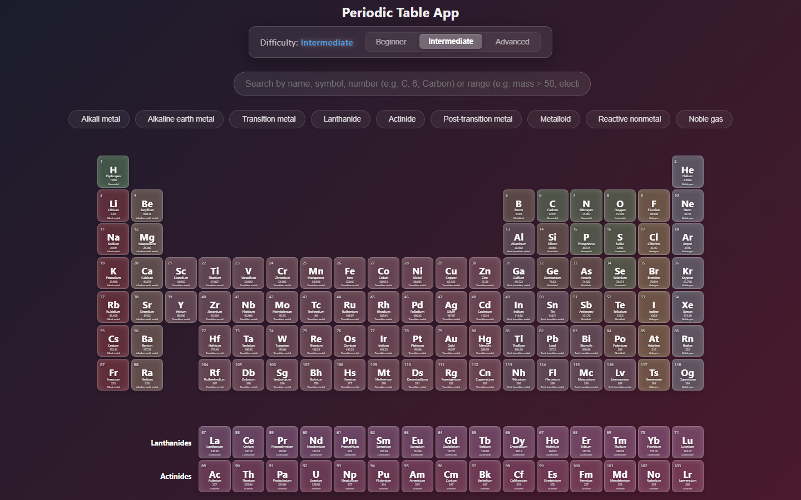
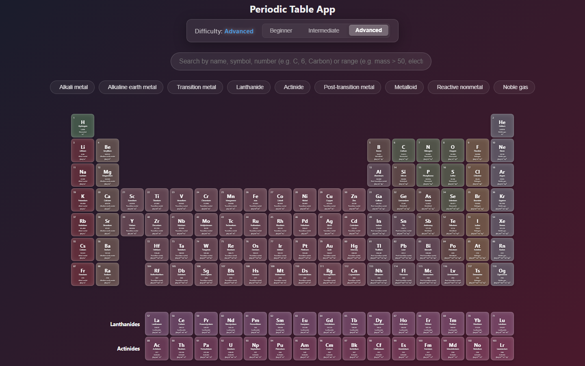
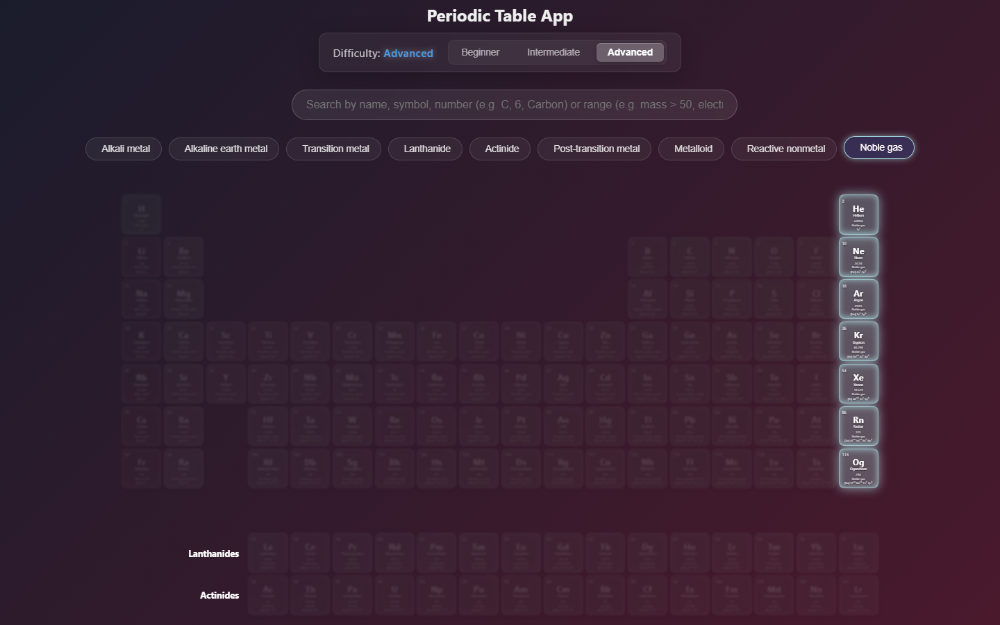
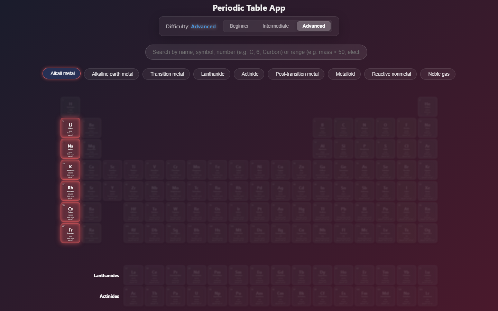
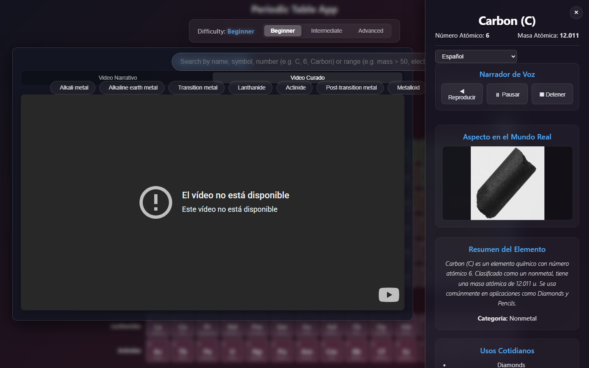
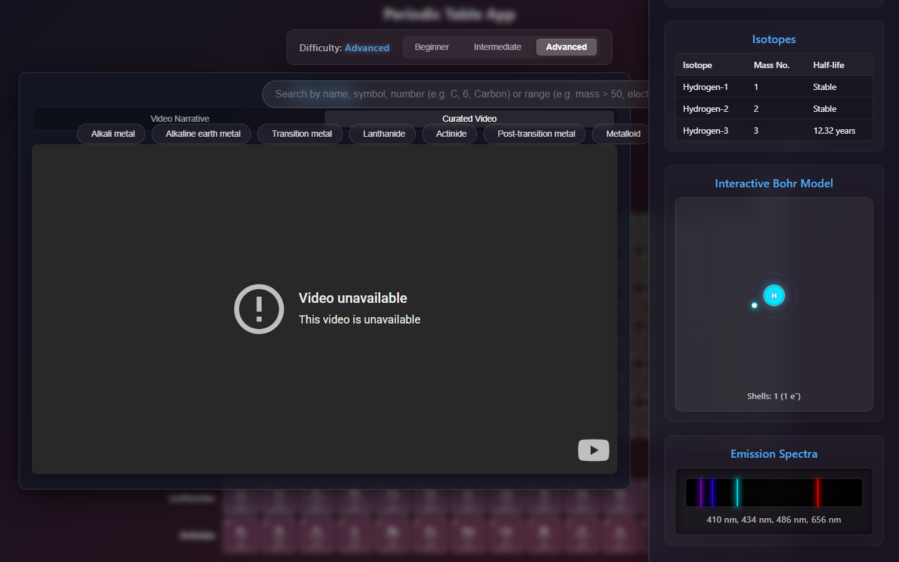
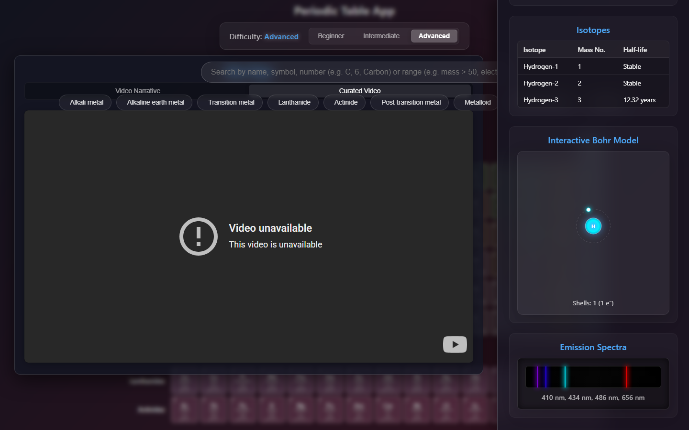
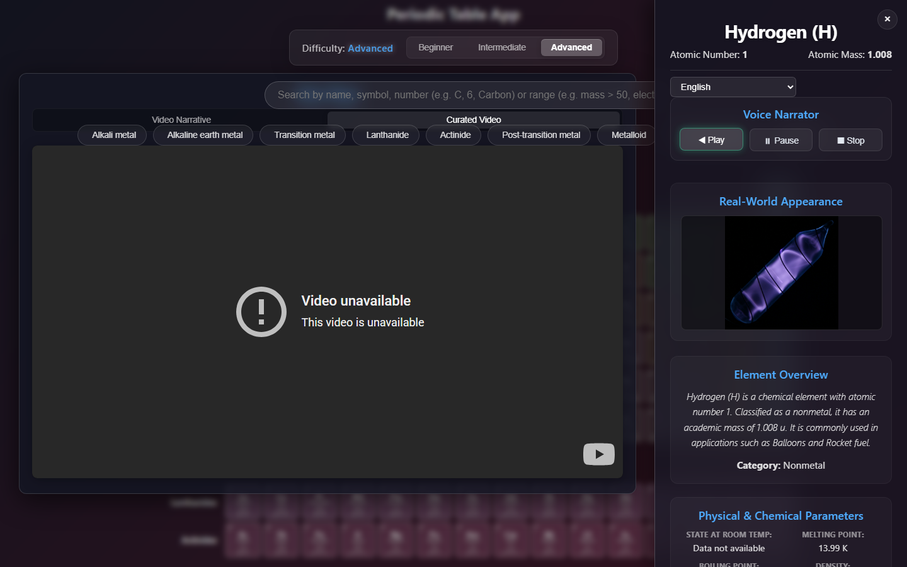

# Periodic Table Application: User Experience Journey Walkthrough

## Academic Introduction
The modern design of interactive educational applications requires a delicate balance between cognitive accessibility and information density. This Periodic Table application was engineered to address this challenge through a multi-modal user interface that caters to diverse learning levels, accessibility requirements, and linguistic backgrounds. 

At the core of the system is a progressive scaffolding framework governed by three difficulty modes: **Beginner**, **Intermediate**, and **Advanced**. These modes dynamically adapt the visual layout and data presentation of the periodic grid and detail panels. By allowing the interface to scale in complexity, the application remains usable for elementary education while remaining functional for professional academic study.

Furthermore, the application incorporates state-of-the-art visualizers and interactive elements. These include a dynamic Bohr model simulation rendered as SVG paths based on real-time parsed electron configurations, and an emission spectra visualizer that converts physical light wavelengths into their corresponding RGB representations using the Dan Bruton spectral color algorithm. Additionally, localized translation engines and accessibility enhancements—such as a SpeechSynthesis voice narrator and a responsive floating video layout—make chemistry education more accessible than ever. This document serves as a complete user experience journey walkthrough, detailing each view, its core design rationale, and its interactive behavior.

---

## User Experience Journey Steps

### Step 1: Beginner Difficulty Grid

The **Beginner** difficulty mode is designed to minimize cognitive load for users who are new to chemistry. In this mode, the periodic table grid displays simplified element cards showing only three primary identifiers: the atomic number, the chemical symbol, and the element name. The IUPAC grid structure is preserved using a responsive CSS Grid layout that scales to fit high-resolution screens without vertical scrolling. Visual styling employs subtle glassmorphism and group-specific color coding (e.g., red for alkali metals, blue for noble gases) to help beginners visually group elements by their chemical families.

---

### Step 2: Intermediate Difficulty Grid

Transitioning to the **Intermediate** difficulty mode introduces quantitative data critical for basic stoichiometry and chemical calculations. Each card dynamically expands to include the atomic mass (expressed in unified atomic mass units, u) and the specific chemical family name (such as "transition metal" or "halogen"). The card layout maintains its proportion and aspect ratio, demonstrating a seamless transition in data density. This tier bridges the gap between pure identifier recognition and numerical problem-solving, making it suitable for high-school chemistry classes.

---

### Step 3: Advanced Difficulty Grid

The **Advanced** difficulty mode represents the highest information density tier, tailored for university students, researchers, and professional chemists. The cards are updated to display the electronic configuration (formatted with subshell designations), electronegativity values, and oxidation states. To accommodate this high-density layout on smaller screen sizes, the grid uses optimized typography and high-contrast text rendering. This view provides a detailed, comprehensive summary of each element's electron shell properties at a single glance.

---

### Step 4: Interactive Legend Filter - Noble Gases

To help users understand the group classifications of the periodic table, the interactive legend acts as a dynamic search filter. Clicking on the "Noble Gases" category in the legend triggers a state update that highlights all elements belonging to Group 18. The matching cards maintain their vibrant family colors and receive a glowing border effect, while all non-matching cards are dimmed to a lower opacity. This visual hierarchy allows students to quickly identify the spatial distribution of noble gases at the right edge of the table.

---

### Step 5: Interactive Legend Filter - Alkali Metals

Clicking the "Alkali Metals" legend item activates a group filter highlighting the elements of Group 1. The application highlights lithium, sodium, potassium, and their heavier homologues, while hydrogen—which is in Group 1 but classified as a reactive nonmetal—is correctly excluded and dimmed. This visual separation helps users understand the distinction between group columns and chemical families. The transition between filters is fully animated using CSS transitions, ensuring a smooth interactive experience.

---

### Step 6: Element Details Panel - Carbon (Beginner Mode, English)

Clicking an element card opens a right-side detail panel that functions as an educational dashboard. For Carbon in **Beginner** mode (English), the panel displays a simple description containing the atomic number, family classification, and a summary of its everyday uses (such as organic life processes, steel alloy manufacturing, and coal). The text is written in accessible, student-friendly language, and includes a real-world photo of the element to connect abstract atomic symbols with physical, visible matter.

---

### Step 7: Element Details Panel - Carbon (Beginner Mode, Spanish)

The application features full multi-lingual support, allowing users to switch languages via a dropdown menu inside the detail panel. When Spanish ('es') is selected, the Carbon panel dynamically translates all labels, headers, and descriptions (e.g., converting "Everyday Uses" to "Usos Cotidianos" and "State at Room Temp" to "Estado a Temp. Ambiente"). The translated description adjusts its sentence structure to match natural Spanish grammar, demonstrating internationalization that supports diverse classrooms.

---

### Step 8: Element Details Panel - Iron (Intermediate Mode)

In **Intermediate** mode, the detail panel displays both qualitative summaries and quantitative physical data. For Iron (Fe), the panel adds a "Physical & Chemical Parameters" section, which lists its state at room temperature, melting point, boiling point, density, crystal structure, discoverer, and discovery year. This display style allows students to analyze the correlation between Iron's macroscopic properties (like its high melting point) and its everyday industrial uses in construction and transportation.

---

### Step 9: Advanced Element Visualizer - Hydrogen Bohr Model

Selecting **Advanced** difficulty mode unlocks the interactive visualizer suite in the detail panel. The first visualizer is the **Interactive Bohr Model**, which dynamically renders the element's electron configuration as a series of concentric orbital rings. The component parses the electron configuration string at run-time to calculate the number of electrons in each shell (K, L, M, etc.). For Hydrogen, it renders a single electron circle orbiting a central nucleus. The electron orbits are animated using CSS-keyframe rotations, providing an engaging simulation of atomic structures.

---

### Step 10: Advanced Element Visualizer - Hydrogen Emission Spectra

Scroll down the advanced details panel to find the **Emission Spectra** visualizer. This tool simulates the glowing lines seen when an element is analyzed through a spectrometer. The component reads the unique wavelengths of light emitted by the excited element, maps each wavelength (in nanometers) to its corresponding RGB value using the Dan Bruton algorithm, and renders them as glowing, high-contrast color bands against a dark background. Moving the mouse over a line displays a tooltip with its exact wavelength, providing a direct link between chemical analysis and light physics.

---

### Step 11: Floating Video Player (Large Screens)

On large screens (1025px wide or greater), the application optimizes desktop space by using a responsive layout for video narration. Selecting the "Video Narrative" tab launches a floating, centered video player. This player overlays the main interface and features full controls for playback. If the local video file is offline, the component displays an informative fallback message recommending the YouTube Curated Video option, ensuring the application remains functional in offline environments.

---

### Step 12: Voice Narrator Controls (SpeechSynthesis)

To support auditory learners and meet accessibility requirements, the detail panel includes a **Voice Narrator** dashboard. Clicking "Play" triggers the Web Speech API's `SpeechSynthesis` engine to read the element's description aloud. The narration text is dynamically constructed to match the active language (English, Spanish, or French) and difficulty level. A controls row containing "Play", "Pause", and "Stop" buttons allows users to manage audio playback, providing assistive support for visually impaired students.
